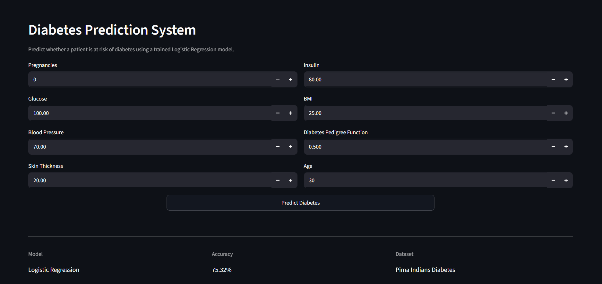
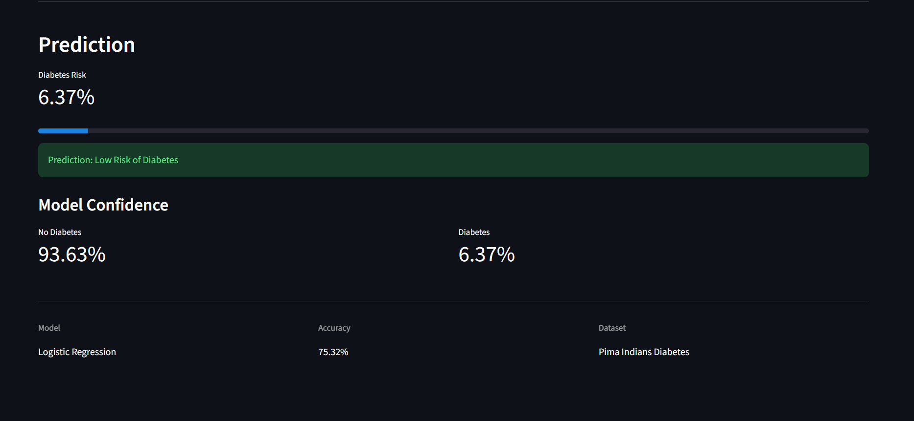
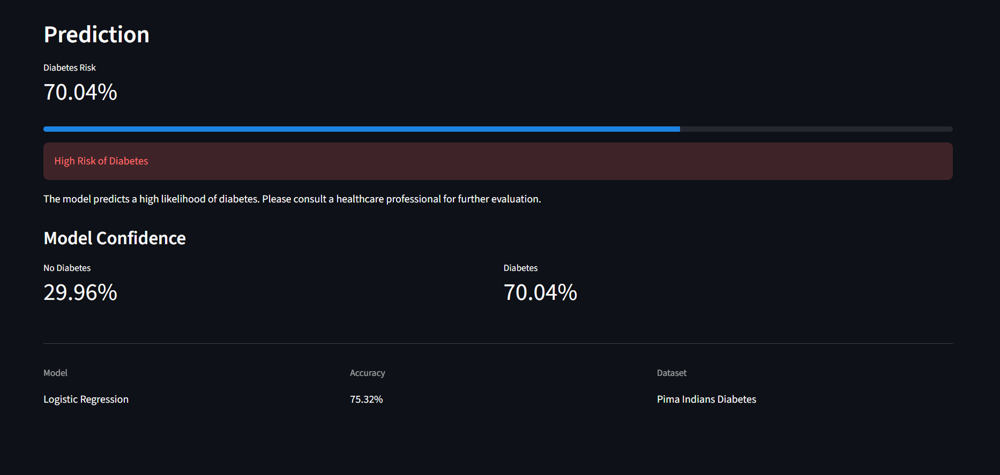

# Diabetes Prediction System

A Machine Learning web application that predicts whether a patient is likely to have diabetes based on medical parameters using Logistic Regression.

---

## Demo

### Home Page



### Low Risk Prediction



### High Risk Prediction



---

## Features

- Predict diabetes risk using Machine Learning
- User-friendly Streamlit interface
- Real-time prediction
- Probability score
- Confidence percentage
- Progress bar visualization
- Logistic Regression model
- Data preprocessing using StandardScaler

---

## Tech Stack

- Python
- Pandas
- NumPy
- Scikit-learn
- Streamlit
- Joblib
- Matplotlib
- Seaborn

---

## Dataset

Pima Indians Diabetes Dataset

Features used:

- Pregnancies
- Glucose
- Blood Pressure
- Skin Thickness
- Insulin
- BMI
- Diabetes Pedigree Function
- Age

---

## Machine Learning Workflow

1. Load dataset
2. Data exploration
3. Handle missing values
4. Feature scaling
5. Train-test split
6. Train Logistic Regression model
7. Evaluate model
8. Save trained model
9. Deploy using Streamlit

---

## Model Performance

| Metric   | Value               |
| -------- | ------------------- |
| Model    | Logistic Regression |
| Accuracy | 75.32%              |

---

## Installation

Install dependencies

```bash
pip install -r requirements.txt
```

Run the application

```bash
python -m streamlit run app.py
```

---

## Project Structure

```
diabetes-prediction/
│
├── data/
│   └── diabetes.csv
│
├── models/
│   ├── diabetes_model.pkl
│   └── scaler.pkl
│
├── screenshots/
│   ├── home.png
│   ├── low-risk.png
│   └── high-risk.png
│
├── app.py
├── train.py
├── requirements.txt
├── README.md


```
